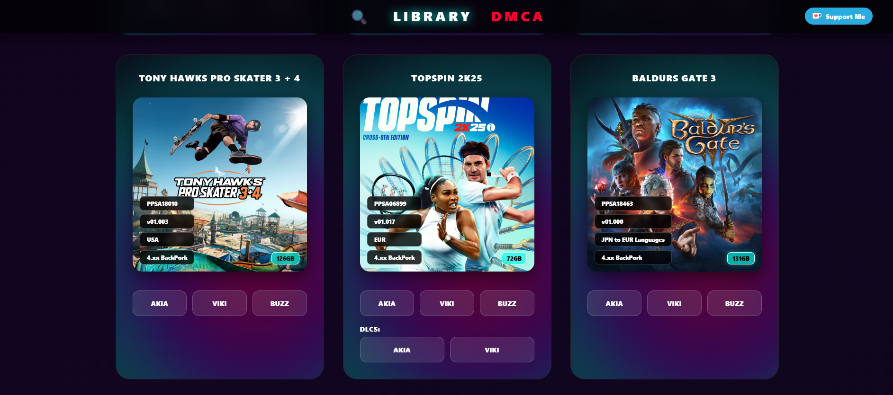

# 🎮 Game Library Immersive UI

A modern, responsive dashboard for browsing a game library, featuring a futuristic "Cyberpunk Neon" interface. This project includes an animated "Trending" section, instant search, and a secure access protection system.

## ✨ Key Features

- **🔥 Trending Section**: Top section with infinite horizontal scrolling for featured titles.
- **🛡️ Access Control**: Protection overlay using SHA-256 hashing (no plain-text passwords stored).
- **📦 JSON Driven**: Simplified content management via an external `exFAT.json` file.
- **🔍 Smart Search**: Dynamic filtering by title and category.
- **💾 Meta-info**: Automatic display of file size, tags, and author credits.
- **📱 Ultra-Responsive**: Design optimized for all screens (Desktop, Tablet, and Mobile).

## ⚖️ Legal Notes & Disclaimer (DMCA)
This project was created for illustrative and personal archiving purposes only.

Data Provenance: This site does not perform direct "dumping" of protected content. All data regarding Dumps and files within the library are already publicly available online on various third-party platforms. This project merely reuses, indexes, and organizes existing information and links, acting as a consultation interface (aggregator).

Responsibility: The end user is solely responsible for the use of the linked content. The creator of this software does not host illegal files on their own servers.

DMCA: If you are a copyright holder and wish to request the removal of a specific link, please refer to the integrated DMCA section on the site to submit a formal notice.

## 🤝 Credits
Special thanks to the community for their support and for sharing the data used to populate this library.

Created with ❤️ for digital preservation.
